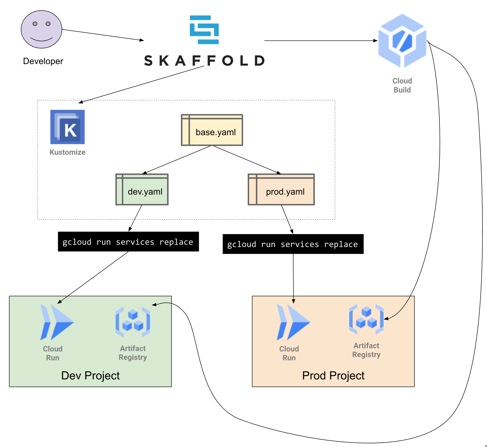

# Multi-environment Config Management for Cloud Run with Kustomize and Skaffold

## Intro

This repo shows an example of using declarative configuration for Cloud Run ([`service.yaml`](https://cloud.google.com/run/docs/deploying#yaml_1))
and managing that configuration for use in multiple environments using [Kustomize](https://kustomize.io/), a template-free way to customize application configuration.

Kustomize allows you to take a [base yaml definition](./base/service.yaml) and then apply incremental patches for various use cases. For example, you may want mostly the same configuration across development and production but with some small tweaks.

In addition to using Kustomize, it uses Skaffold drive the automation of building our Docker image with Cloud Build and the creation of the config using Kustomize. When you want to develop you can run `skaffold render` to build an image from your local workspace and setup your Cloud Run `service.yaml` with the reference to that image.

The base configuration is setup in the [`base` folder](./base/). That is then [patched for `dev`](./dev/) so that we only get a maximum of 2 instances to save on costs.
Another set of patches are applied to the configuration for [`prod`](./prod/) so that we have a minimum of 2 instances such that users dont have ever hit the service and need to wait for a cold start.



## Tutorial

1. Install pre-requisite tools.

    ```shell
    gcloud components install kustomize skaffold
    ```

1. Create 2 projects, one for development and another for production.

    ```shell
    export DEV_PROJECT=${USER}-cloud-run-kustomize-dev
    export PROD_PROJECT=${USER}-cloud-run-kustomize-prod
    gcloud projects create ${DEV_PROJECT}
    gcloud services enable cloudbuild.googleapis.com \
                           run.googleapis.com \
                           containerregistry.googleapis.com \
                           --project ${DEV_PROJECT}
    gcloud projects create ${PROD_PROJECT}
    gcloud services enable cloudbuild.googleapis.com \
                           run.googleapis.com \
                           containerregistry.googleapis.com \
                           --project ${DEV_PROJECT}
    ```

1. Build the development version of the app and run it. Do this as many times as you need to feel comfortable that your changes are correct.

    ```shell
    skaffold render --default-repo=gcr.io/${DEV_PROJECT} \
                    --add-skaffold-labels=false --loud \
                    -o service-dev.yaml
    gcloud beta run services replace service-dev.yaml --region us-west2 --project ${DEV_PROJECT}
    ```

1. Deploy to the production project when you've got things just how you like them.

    ```shell
    skaffold render --default-repo=gcr.io/${PROD_PROJECT} \
                   --add-skaffold-labels=false --loud \
                   --profile prod -o service-prod.yaml
    gcloud beta run services replace service-prod.yaml --region us-west2 --project ${PROD_PROJECT}
    ```
